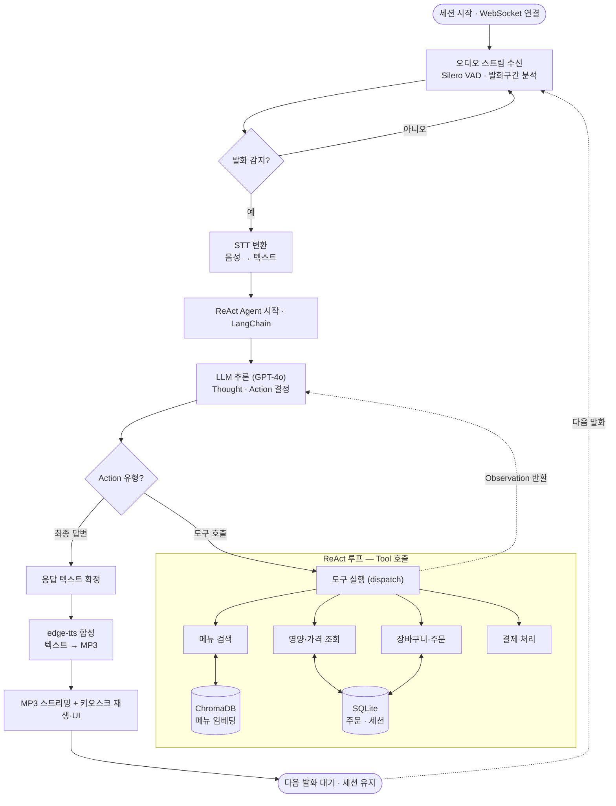

# 사용자 의도 파악 및 맥락기반 추천 기능을 갖춘 지능형 음성 결제 에이전트

기존 키오스크의 복잡한 계층형 UI를 거칠 필요 없이 사용자의 자연스러운 음성 발화를 AI 에이전트가 스스로 분석, 판단하여 필요한 동작을 자율적으로 수행하는 무인 단말기용 음성 주문 시스템입니다. ([Front-End](https://github.com/seb0070/sadollar-kiosk-fe))

<div align="center">

<table>
  <tr>
    <td align="center">
      <a href="https://github.com/ramimi12"></a><br/>
      <sub><b>김보람</b></sub><br/>
    </td>
    <td align="center">
      <a href="https://github.com/culyrh"></a><br/>
      <sub><b>박소현</b></sub><br/>
    </td>
    <td align="center">
      <a href="https://github.com/yuannnna"></a><br/>
      <sub><b>유한나</b></sub><br/>
    </td>
    <td align="center">
      <a href="https://github.com/seb0070"></a><br/>
      <sub><b>정세빈</b></sub><br/>
    </td>
  </tr>
</table>

</div>

---

## 기술 스택

| 분류 | 기술 |
|------|------|
| **AI / LLM** | GPT-4o, LangChain ReAct, ChromaDB, ko-sroberta-multitask |
| **음성 처리** | Whisper API, Silero VAD, edge-tts |
| **백엔드** | FastAPI, SQLite, WebSocket |
| **프론트엔드** | React |
| **인프라** | AWS EC2, Docker |

---

## 목적

### 디지털 취약계층의 키오스크 이용 격차 해소를 위해, 음성 발화만으로 메뉴 검색부터 결제까지 전 과정을 처리하는 AI 음성 주문 키오스크를 구축한다.

```
사용자 음성
↓  WebSocket
Silero VAD → Whisper STT
↓
LangChain ReAct 에이전트 (GPT-4o)
↓
┌────────────────────────────────────────────────┐
│  메뉴 검색     영양/가격 조회   장바구니/주문  │
│  ChromaDB         SQLite            SQLite     │
└────────────────────────────────────────────────┘
↓
edge-tts → 음성 + 화면 액션 응답
```

---

## 구현 내용

### I. 데이터 구축

롯데리아 공식 사이트를 Selenium 크롤러로 수집하여 단품 78개, 세트 23개, 옵션 41개를 SQLite DB에 구축하였다. 메뉴명·설명·원산지를 하나의 텍스트로 결합하여 ChromaDB에 벡터로 저장하고, 가격·카테고리·알레르기·뱃지·매운맛 단계는 metadata로 분리하여 벡터 검색과 조건 필터링을 독립적으로 처리할 수 있도록 설계하였다.

### II. 음성 처리 (STT / VAD / TTS)

STT는 4개 모델(whisper-ko-zeroth, Qwen, Whisper small 로컬, Whisper API)을 화자 4인·환경 2종(기본/소음)·총 320개 샘플로 비교 평가하여 Whisper API(평균 CER 7.76%, 응답속도 1,394ms)를 최종 채택하였다. 발화 구간 검출에는 Silero VAD를 적용하여 512 sample(32ms) 단위로 배경 소음과 실제 발화를 구분하며, 발화 시작 전 128ms pre-roll을 포함하여 앞 음절 누락을 방지하였다. 

TTS는 Microsoft edge-tts(ko-KR-SunHiNeural)를 채택하였으며, LLM 응답 전체를 기다리지 않고 문장 단위로 즉시 합성·전송하는 스트리밍 방식으로 체감 응답속도를 단축하였다.

### III. AI 에이전트 (LangChain ReAct + RAG)

에이전트는 LangChain ReAct 워크플로우로 구현하였으며 GPT-4o(temperature=0)를 사용한다. 메뉴 검색은 자연어 query가 있을 때 ChromaDB 벡터 검색을, 카테고리·뱃지 등 조건 필터가 명확한 경우 SQLite 직접 쿼리로 자동 분기하는 하이브리드 방식을 적용하였다.

STT 오인식에 대응하여 메뉴 조회 시 ① 완전 일치 → ② 토큰 AND LIKE → ③ 접두어 단계별 수집의 3단계 퍼지 매칭을 구현하였다. 멀티턴 대화는 세션별 슬라이딩 윈도우(최근 5턴)로 관리하며, TYPE_SELECT → DRINK_SELECT → SIDE_SELECT로 이어지는 주문 흐름에서 이전 선택값을 히스토리에서 참조하여 연속적인 맥락을 유지한다.

### IV. 백엔드 / 프론트엔드

백엔드는 초기 Spring + FastAPI 이중 구조에서 FastAPI 단일 서버로 통합하였다. 욕설 필터링은 ① 백엔드 미들웨어 → ② WebSocket 수신 → ③ 시스템 프롬프트의 3단계로 구현하였으며, 3분 비활성 시 장바구니·히스토리 자동 초기화 및 TIMEOUT 액션 전송 기능을 추가하였다. 프론트엔드는 React로 개발하였으며 KioskScaler 컴포넌트로 430px 기준 화면 비율을 자동 조정하여 실제 키오스크 환경에서도 동일한 UI를 제공한다.



---

## 주요 설계 포인트

### 1. Silero VAD 처리 정책

키오스크 환경은 매장 소음·원거리 대화 등 배경 잡음이 다양하므로, 단순 무음 감지만으로는 오탐이 잦다. 따라서 연결 초기에 자동 캘리브레이션을 수행하고 발화 판정에 여러 조건을 조합한다.

Silero VAD는 16kHz 기준 정확히 512 샘플(32ms) 단위의 입력만 허용하므로, 클라이언트가 50ms 단위로 전송하는 PCM 청크를 내부 버퍼에 누적 후 512 샘플씩 슬라이딩 처리한다. 

| 정책 | 값 | 근거 |
|------|-----|------|
| 캘리브레이션 워밍업 | 0.5s 버림 | 마이크 AGC 안정화 전 구간 제거 |
| 소음 측정 | 이후 1.5s RMS p75 | 순간 튀는 값을 제외한 전형적 배경 소음 측정 |
| 적응형 에너지 게이트 | 소음 p75 × 1.5 | 세션마다 키오스크 소음 환경에 맞게 자동 조정 |
| 확신도 임계값 | 0.5 → **0.65** | 낮추면 원거리 대화·소음도 발화로 오인 |
| 무음 판정 시간 | 800ms → **500ms** | 키오스크 단문 명령에 최적화, 체감 응답속도 단축 |
| 발화 패딩 | 100ms → **50ms** | 발화 끝 잘림 방지와 응답속도 균형 |
| Pre-roll 버퍼 | 4 × 32ms = **128ms** | VAD start 이전 구간 포함, 첫 음절 잘림 방지 |

---

### 2. 하이브리드 검색 분기

`search_menu`는 `query` 파라미터 유무에 따라 검색 경로를 분기한다.

- **query 없음 → SQLite 직접 쿼리**: category·badge·exclude 조합으로 SQL WHERE 절 동적 생성. BEST 뱃지 우선 정렬(`badge_order`)로 자연스러운 추천 순서 유지.
- **query 있음 → ChromaDB 벡터 검색**: `ko-sroberta-multitask` 임베딩으로 의미 유사도 검색. cosine distance 임계값 0.5 이하만 통과 (category·badge 필터 활성 시 threshold 미적용).
- **exclude + query 충돌**: 제외 재료가 query에 포함된 경우(예: "새우 알레르기인데 새우 버거 말고") query를 비워 SQL 경로로 강제 전환, 재료 제외가 의미 검색보다 우선.
- **후처리 필터 시 k 확장**: spicy·exclude 필터가 활성화된 경우 k=10으로 초과 조회 후 필터링. k=5로 고정하면 필터 통과 결과가 0개가 되는 케이스 방지.
- **동의어 자동 확장**: `_SYNONYMS` 딕셔너리로 "새우" 제외 → "쉬림프"도 자동 포함, 벡터 검색 키워드 필터에도 동일 적용.

---

### 3. 문장 단위 TTS 스트리밍

LLM 전체 응답을 기다리지 않고, `chat_stream()`이 `.!?` 기준으로 문장이 완성될 때마다 yield한다. WebSocket 핸들러는 수신 즉시 TTS 합성 후 오디오 bytes를 클라이언트로 전송한다.

```
LLM 스트리밍 토큰 축적
→ .!? 문장 완성 감지
→ synthesize_async(sentence)  ← 문장 단위 TTS
→ websocket.send_bytes(audio)  ← 즉시 전송
→ (다음 문장 반복)
→ 최종 JSON 메타데이터 send_text  ← screen/action/latency 포함
```

단, LLM이 JSON 형식으로 응답할 때는 토큰을 하나씩 내보내지 않고 전체를 한 번에 반환하는 경우가 있다. 이때는 위 스트리밍 흐름이 동작하지 않으므로, 최종 응답 JSON에서 voice 값을 꺼내 TTS를 합성하는 별도 처리도 함께 구현했다.

---

### 4. pipeline_lock 직렬화

사용자가 연속으로 말하면 두 파이프라인이 동시에 실행되어 `conversation_history`를 동시에 읽고 쓰는 race condition이 발생한다.

OpenAI API는 에이전트가 도구를 호출한 기록(`tool_call`)과 그 실행 결과(`tool_result`)가 반드시 쌍으로 존재해야 한다. 첫 번째 파이프라인이 도구를 호출하고 결과를 기다리는 사이에 두 번째 파이프라인이 히스토리를 읽으면, `tool_call`만 있고 `tool_result`는 아직 없는 불완전한 상태로 API가 호출되어 400 에러가 발생한다.

세션마다 `asyncio.Lock`을 생성해 파이프라인이 한 번에 하나씩만 실행되도록 직렬화함으로써 항상 `tool_call · tool_result` 쌍이 보장된다.

---

### 5. 3단계 퍼지 매칭

STT가 메뉴명을 오인식한 경우("불고기버그" → "불고기버거")에도 검색이 가능하도록 SQL 기반 다단계 매칭을 적용한다. 공백은 `REPLACE_SPACE()` 커스텀 함수로 제거 후 비교한다.

| 단계 | 방식 | 예시 |
|------|------|------|
| 1차 | `REPLACE_SPACE(name) = ?` 완전 일치 | "불고기버거" = "불고기버거" |
| 2차 | 토큰별 `AND LIKE` + 최장 토큰 병합 | "불고기" AND "버거" |
| 2.5차 | 토큰 하나씩 제거하며 AND 재시도 (3개↑ 토큰) | "리아 불고기 버거" → "불고기 버거" |
| 3차 | 접두어 단계별 수집 (`_build_search_terms`) | "불고기버그" → "불고기버" → "불고기" |

3차에서는 정규화된 이름 길이의 절반 이하로 접두어가 짧아지면 수집을 중단해 과도한 매칭을 방지한다.

---


## 주요 기능

- **End-to-end 음성 주문**: 메뉴 검색, 장바구니 담기, 수량 변경, 취소, 결제까지 전 과정 처리
- **메뉴 추천 및 검색**: "가볍게 먹을 수 있는 거", "새우 빼고 덜 매운 거" 등 키워드 없이도 의도에 맞는 메뉴 검색
- **맥락 인식형 대화**: 세션별 슬라이딩 윈도우(최근 5턴)로 대화 흐름 유지, 이전 발화 참조 가능
- **욕설 필터링**: 백엔드 미들웨어 → WebSocket → 시스템 프롬프트 3단계 필터링

---

## 실행 방법

### 요구사항
```
Python 3.10.11
```

### 설치
```bash
# 가상환경 생성 및 활성화
py -3.10 -m venv venv
venv\Scripts\activate      # Windows
source venv/bin/activate   # Mac/Linux

# 패키지 설치
pip install -r requirements.txt
```

### 환경변수 설정
`.env` 파일 생성:
```
OPENAI_API_KEY=sk-...
```

### DB 및 벡터 DB 초기화 (최초 1회)
```bash
python db_setup.py      # 테이블 생성
python insert_data.py   # 데이터 삽입
python build_index.py   # ChromaDB 벡터 생성
```

### 서버 실행
```bash
python -m uvicorn api.main:app --reload
```

Swagger UI: http://127.0.0.1:8000/docs

---

## 데이터 구조

### SQLite (ria_menu.db)

| 테이블 | 역할 | 데이터 수 |
|--------|------|-----------|
| menu | 단품 메뉴 | 78개 |
| set_menus | 버거별 세트 구성 및 가격 | 23개 |
| options | 드링크/사이드 옵션 | 41개 |
| cart | 세션별 장바구니 | - |
| orders | 결제 완료 주문 내역 | - |

### ChromaDB
- 임베딩 모델: `jhgan/ko-sroberta-multitask`
- 저장 형식: 메뉴명·설명·원산지를 `page_content`로, 가격·카테고리·알레르기·뱃지를 `metadata`로 분리 저장
- 유사도 기준: cosine distance

---

## AI 에이전트 Tool 목록

| 분류 | 함수 | 기능 |
|------|------|------|
| 메뉴 | `search_menu` | 자연어 기반 메뉴 검색 (벡터+SQL 하이브리드) |
| 메뉴 | `get_menu_info` | 특정 메뉴 가격·설명 조회 |
| 메뉴 | `get_menu_by_price` | 가격 기준 조회 |
| 메뉴 | `get_menu_by_nutrition` | 영양소(칼로리/당류/단백질) 기준 조회 |
| 메뉴 | `get_set_info` | 세트 메뉴 정보 및 옵션 조회 |
| 장바구니 | `add_to_cart` | 메뉴 추가 |
| 장바구니 | `update_cart_quantity` | 수량 변경 |
| 장바구니 | `remove_from_cart` | 항목 제거 |
| 장바구니 | `upgrade_to_set` | 단품 → 세트 전환 |
| 장바구니 | `downgrade_to_single` | 세트 → 단품 전환 |
| 장바구니 | `view_cart` / `clear_cart` | 조회 / 전체 비우기 |
| 주문 | `confirm_order` | 주문 완료 및 결제 처리 |

---

## 프로젝트 구조

```
sadollar-kiosk/
│
├── api/
│   ├── main.py                    # FastAPI 서버 진입점 + 욕설 필터링 미들웨어
│   └── routes/
│       ├── menu.py                # 메뉴 API
│       ├── sets.py                # 세트 메뉴 API
│       ├── options.py             # 옵션 API
│       ├── cart.py                # 장바구니 API
│       ├── order.py               # 주문/결제 API
│       ├── search.py              # RAG 검색 API
│       └── stt.py                 # STT/TTS WebSocket
│
├── app/
│   ├── agent.py                   # LangChain ReAct 에이전트
│   ├── session_context.py         # 세션 ID 관리
│   ├── latency_tracker.py         # 레이턴시 측정
│   ├── rag/
│   │   ├── loader.py              # SQLite → Document 변환
│   │   ├── vector_store.py        # ChromaDB 임베딩 저장
│   │   ├── chroma.py              # ChromaDB 연결
│   │   └── search.py              # RAG 검색 로직
│   └── tools/
│       ├── menu_tools.py          # 메뉴 검색 도구
│       └── cart_tools.py          # 장바구니/주문 도구
│
├── voice/
│   ├── stt.py                     # Whisper STT
│   ├── stt_realtime.py            # 실시간 STT
│   ├── tts.py                     # edge-tts TTS
│   └── vad_silero.py              # Silero VAD
│
├── crawling/
│   ├── crawling.py                # 단품 메뉴 크롤링
│   ├── crawling_set.py            # 세트 메뉴 크롤링
│   └── crawling_setimage.py       # 세트 이미지 크롤링
│
├── data/
│   ├── ria_menu.json              # 단품 메뉴 데이터
│   ├── ria_options.json           # 옵션 데이터
│   ├── ria_sets.json              # 세트 메뉴 데이터
│   └── ria_menu.db                # SQLite DB
│
├── db_setup.py                    # DB 테이블 생성
├── insert_data.py                 # JSON → DB 삽입
├── build_index.py                 # ChromaDB 초기화
├── test_pipeline.py               # 전체 파이프라인 테스트
├── visualize_embeddings.py        # 임베딩 벡터 시각화
├── requirements.txt
└── .env
```
